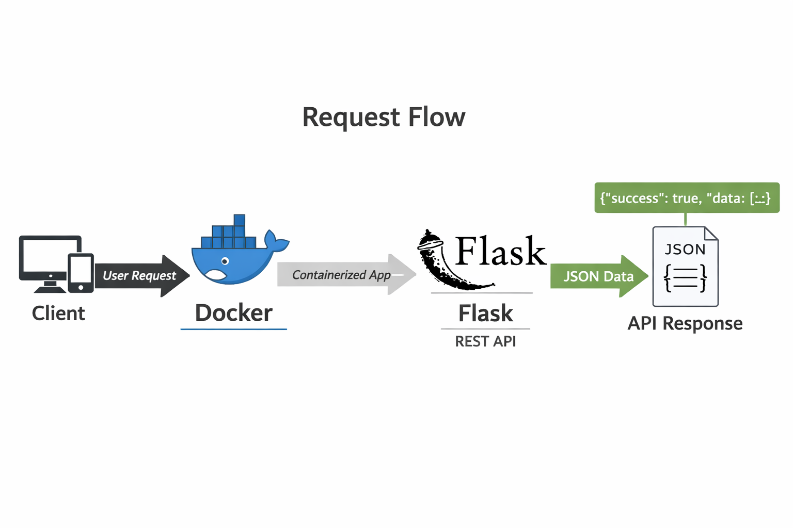
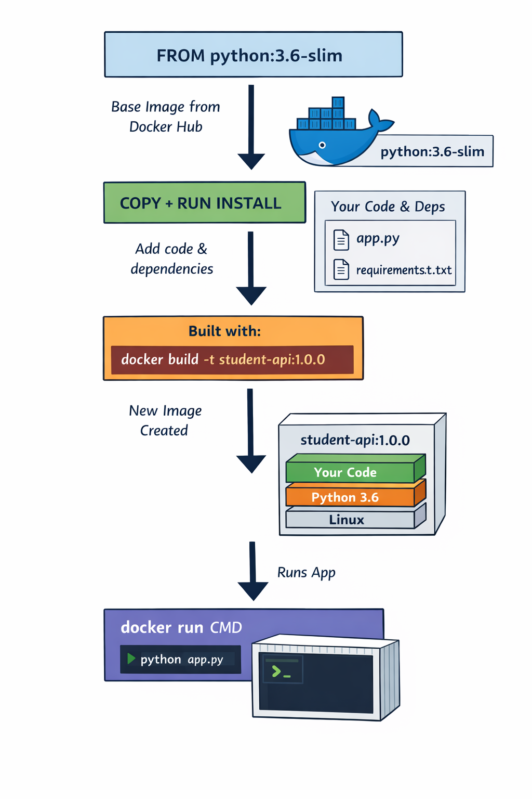

# Student REST API

A simple REST API built using Python and Flask to manage student data.
This is a Flask-based REST API containerized using Docker.  
I used a multi-stage Docker build to separate dependency installation from runtime, which reduces image size and improves security.  
I automated Docker operations using a Makefile to standardize build and run commands.  
The application is configurable via environment variables and exposes REST endpoints for health checks and student data.

---

## Features

- Health check endpoint (`/health`)  
- Get all students (`GET /api/v1/students`)  
- Add a new student (`POST /api/v1/students`)  
- REST-based JSON responses  
- Environment-variable based configuration for portability  

---

## Tech Stack

- Python 3.6+  
- Flask  
- SQLAlchemy (SQLite database)  
- Docker  

---

## Local Setup (Without Docker)

1. **Clone the repository:**

```bash
git clone <repo-url>
cd student-api
```
2. **Install dependencies:**

```bash
pip install -r requirements.txt
```
3. **Create a `.env` file in the project root:**

```text
ENV=development
PORT=5000
DEBUG=true
DATABASE_URL=sqlite:///students.db
```
4. **Run the application:**

```bash
python app.py
```
5. **Verify the application:**

- Health check: http://localhost:5000/health
- Get all students: http://localhost:5000/api/v1/students

---

## Docker Setup

Docker allows you to run the application without installing Python or dependencies locally.

### Request flow in containerized app
<p align="center">
  
</p>

### Build Docker Image

Run the following command to build the Docker image:

```bash
docker build -t student-api:1.1.1 .
```
## Architecture Diagram

<p align="center">
  
</p>

### Run Docker Container
```bash
docker run -d \
  --name student-api \
  -p 5000:5000 \
  -e PORT=5000 \
  -e DEBUG=false \
  student-api:1.1.1
  ```

## Architecture Diagram of Docker image with env variables
<p align="center">
  
</p>

### Verify Dockerized Application
- Health check: http://localhost:5000/health
- Get all students: http://localhost:5000/api/v1/students
---

## Docker Compose & One-Click Local Setup

This project uses docker-compose to run the API and its dependent services together.

### Pre-requisites

Make sure the following tools are installed on your system:

- Docker
- Docker Compose
- GNU Make
- Powershell(Windows users)

### Services Managed by Docker Compose

- PostgreSQL – database service
- API – Flask REST API

### Makefile Targets

The Makefile provides a simplified, one-click developer workflow.

| Command        | Description                                         |
| -------------- | --------------------------------------------------- |
| `make db-up`   | Start PostgreSQL container                          |
| `make migrate` | Run database migrations                             |
| `make build`   | Build REST API Docker image                         |
| `make up`      | Start DB → run migrations → build image → start API |
| `make down`    | Stop all containers                                 |
| `make logs`    | View container logs                                 |
---
### One-Click Local Development Setup

Run the following command:

```bash
make up
```
### Order of Execution

When make up is executed:

- PostgreSQL container is started using Docker Compose

- System waits for database readiness

- Database schema migrations are applied

- REST API Docker image is built

- REST API container is started

- This guarantees that the application always runs with a ready database and updated schema.
---
### Verify Application (Dockerized)

- Health check: http://localhost:5000/health
- Get all students: http://localhost:5000/api/v1/students
---
## Docker-hosted student API system architecture

<p align="center">
  
</p>

