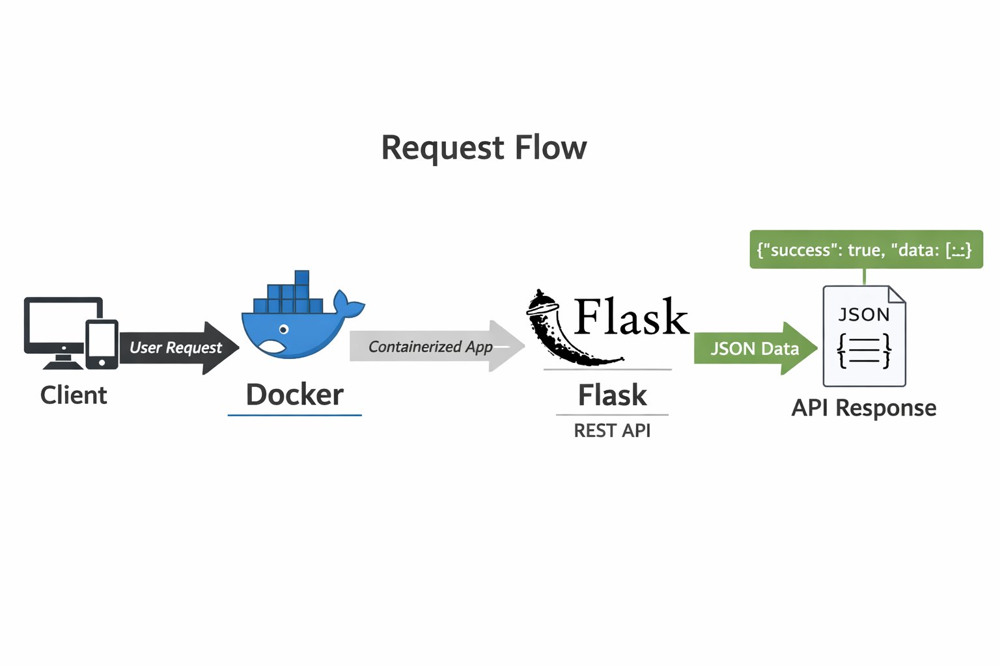
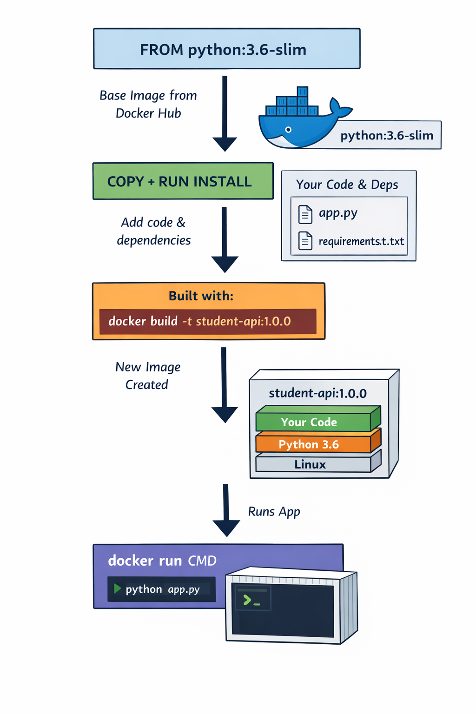

# STUDENT REST API

A simple REST API built using Python and Flask to manage student data.
This is a Flask-based REST API containerized using Docker.  
I used a multi-stage Docker build to separate dependency installation from runtime, which reduces image size and improves security.  
I automated Docker operations using a Makefile to standardize build and run commands.  
The application is configurable via environment variables and exposes REST endpoints for health checks and student data.

---

## Features

- Health check endpoint (`/health`)  
- Get all students (`GET /api/v1/students`)  
- Add a new student (`POST /api/v1/students`)  
- REST-based JSON responses  
- Environment-variable based configuration for portability  

---

## Tech Stack

- Python 3.10
- Flask  
- SQLAlchemy (SQLite database)  
- Docker  

---

## Local Setup (Without Docker)

1. **Clone the repository:**

```bash
git clone <repo-url>
cd student-api
```
2. **Install dependencies:**

```bash
pip install -r requirements.txt
```
3. **Create a `.env` file in the project root:**

```text
ENV=development
PORT=5000
DEBUG=true
DATABASE_URL=sqlite:///students.db
```
4. **Run the application:**

```bash
python run.py
```
5. **Verify the application:**

- Health check: http://localhost:5000/health
- Get all students: http://localhost:5000/api/v1/students

---

## Docker Setup

Docker allows you to run the application without installing Python or dependencies locally.

### Request flow in containerized app
<p align="center">
  
</p>

### Build Docker Image

Run the following command to build the Docker image:

```bash
docker build -t student-api:1.1.1 .
```
## Architecture Diagram

<p align="center">
  
</p>

### Run Docker Container
```bash
docker run -d \
  --name student-api \
  -p 5000:5000 \
  -e PORT=5000 \
  -e DEBUG=false \
  student-api:1.1.1
  ```

## Architecture Diagram of Docker image with env variables
<p align="center">
  
</p>

### Verify Dockerized Application
- Health check: http://localhost:5000/health
- Get all students: http://localhost:5000/api/v1/students
---

## Docker Compose & One-Click Local Setup

This project uses docker-compose to run the API and its dependent services together.

### Pre-requisites

Make sure the following tools are installed on your system:

- Docker
- Docker Compose
- GNU Make
- Powershell(Windows users)

### Services Managed by Docker Compose

- PostgreSQL – database service
- API – Flask REST API

### Makefile Targets

The Makefile provides a simplified, one-click developer workflow.

| Command        | Description                                         |
| -------------- | --------------------------------------------------- |
| `make db-up`   | Start PostgreSQL container                          |
| `make migrate` | Run database migrations                             |
| `make build`   | Build REST API Docker image                         |
| `make up`      | Start DB → run migrations → build image → start API |
| `make down`    | Stop all containers                                 |
| `make logs`    | View container logs                                 |
---
### One-Click Local Development Setup

Run the following command:

```bash
make up
```
### Order of Execution

When make up is executed:

- PostgreSQL container is started using Docker Compose

- System waits for database readiness

- Database schema migrations are applied

- REST API Docker image is built

- REST API container is started

- This guarantees that the application always runs with a ready database and updated schema.
---
### Verify Application (Dockerized)

- Health check: http://localhost:5000/health
- Get all students: http://localhost:5000/api/v1/students
---
## Docker-hosted student API system architecture

<p align="center">
  
</p>

---
## CI PIPELINE

This project uses GitHub Actions to implement a Continuous Integration (CI) pipeline.

The pipeline performs the following stages:

- Code linting using flake8
- Unit testing using pytest
- Docker image build
- Docker login to DockerHub
- Docker image push to central registry

### Trigger Conditions

The CI pipeline runs when:
- Changes are pushed to the main branch
- Changes are made inside:
  - app/
  - tests/
  - Dockerfile
  - requirements.txt

The workflow also supports manual triggering using workflow_dispatch.

The pipeline runs on a self-hosted GitHub runner configured on the local machine.

## CI Pipeline Overview

<p align="center">
  
</p>

---

## REST API Deployment on Bare Metal using Vagrant, Docker & Nginx

The infrastructure is provisioned using shell automation and deployed using **Docker Compose** with **Nginx acting as a reverse proxy and load balancer**.

### Key Capabilities

- Horizontal scaling (2 API containers)
- Reverse proxy configuration
- Round-robin load balancing
- Infrastructure automation
- Reproducible deployments
- Production-style environment simulation

---

##  Architecture

### Components

| Component | Description |
|------------|-------------|
| Vagrant VM | Simulates a bare-metal production environment |
| API (x2) | Stateless REST API containers |
| PostgreSQL | Database container |
| Nginx | Reverse proxy and load balancer |
| Docker Compose | Multi-container orchestration |
| Makefile | Deployment automation |

---

##  Tech Stack

- Vagrant (Ubuntu 22.04)
- Docker
- Docker Compose
- Nginx
- PostgreSQL
- Bash Scripting
- Makefile

---

##  Project Structure

```text
.
├── Vagrantfile
├── deploy.sh
├── docker-compose.yml
├── Makefile
├── nginx/
│   └── nginx.conf
├── api/
│   ├── Dockerfile
│   └── app.py
└── README.md
```
---

##  Prerequisites

Ensure the following are installed on your host machine:

- Vagrant
- VirtualBox
- Git

---

## Deployment Guide

###  Start the Production VM

```bash
vagrant up
```
SSH into the VM:
```
vagrant ssh
```
Deploy Application Stack

Inside the VM:
```
make deploy
```
 This command:
 - Builds Docker images
 - Starts containers
 - Mounts Nginx configuration
 - Orchestrates services via Docker Compose

## Access Application

 Application will be available at:
 ```
 http://localhost:8080
 ```
 ## Load Balancing Strategy
 Nginx is configured using an upstream block:
 ```
 upstream backend {
     server api_1:5000;
     server api_2:5000;
 }
 ```
 ## Verification
 Check Running Containers
 ```
 docker ps
 ```
 Expected running containers:
 2 API containers
 1 Database container
 1 Nginx container

## Test Using CURL
 ```
 curl http://localhost:8080
 ```
 Expected response:
 ```
 HTTP/1.1 200 OK
 ```
Repeated requests should return responses from different container hostnames (verifying load balancing).

## Test Using Postman

- Import the providd Postman collection
- Verify all endpoints return 200 OK
- Confirm traffic is balanced between API containers
## Stop Services
 ```
 make down
 ```
## Rebuild Deployment
 ```
 make build
 make up
 ```
---
<p align="center">
  
</p>

---
# Kubernetes Cluster Setup using Minikube
This project uses a multi-node Kubernetes cluster created using Minikube to simulate a production-style Kubernetes environment locally.

The Kubernetes cluster is logically separated into dedicated nodes for:

- Application workloads
- Database workloads
- Dependent platform services such as Vault and observability stack

This setup helps simulate real-world infrastructure isolation and workload scheduling practices used in production Kubernetes environments.

---

## Kubernetes Cluster Architecture

| Node | Purpose | Label |
|------|----------|-------|
| Node A | Application workloads | `type=application` |
| Node B | Database workloads | `type=database` |
| Node C | Dependent services (Vault, ESO, Monitoring) | `type=dependent_services` |

---

## Technologies Used

- Kubernetes
- Minikube
- kubectl
- Docker Driver

---

## Start Multi-Node Kubernetes Cluster

### Create a 3-Node Minikube Cluster

```bash
minikube start --nodes 3 -p student-cluster --driver=docker

```
### Verify Cluster Nodes

```bash
kubectl get nodes
```
### Expected output:
```bash
kubectl get nodes
NAME                  STATUS   ROLES           AGE   VERSION
student-cluster       Ready    control-plane   13d   v1.33.1
student-cluster-m02   Ready    <none>          13d   v1.33.1
student-cluster-m03   Ready    <none>          13d   v1.33.1
```
### Add Node Labels

### Label Application Node

```bash
kubectl label node student-cluster type=application
```
### Label Database Node
```bash
kubectl label node student-cluster-m02 type=database
```
### Label Dependent Services Node
```bash
kubectl label node student-cluster-m03 type=dependent_services
```
### Verify Node Labels

```bash
kubectl get nodes --show-labels
```
### Expected Labels:
```bash
type=application
type=database
type=dependent_services
```
### Why Node Labels Are Used

Node labels are used for workload isolation and controlled scheduling using Kubernetes nodeSelector.

This allows:

Application pods to run only on the application node
PostgreSQL database pods to run only on the database node
Vault and dependent platform services to run only on the dependent services node

---
### Create Application Namespace

```bash
kubectl create namespace student-api
```
### Verify Namespaces

```bash
kubectl get namespaces
```
### Expected Output

```bash
PS D:\HFL\student_api> kubectl get namespaces
NAME               STATUS   
default            Active   
student-api        Active   
```
### Verify Cluster Health

```bash
kubectl get nodes -o wide
```
### Expected Output:

```bash
kubectl get nodes -o wide
NAME                  STATUS              
student-cluster       Ready    control-plane  
student-cluster-m02   Ready    <none>          
student-cluster-m03   Ready    <none>          
```
---

<p align="center">
  
</p>

---

# Kubernetes Deployment of REST API & Dependent Services

This project is deployed on a **3-node Kubernetes cluster** created using **Minikube**.  
The application, database, and dependent services are deployed using Kubernetes manifests.

---

## Learning Outcomes

- Creating and managing Kubernetes manifests
- Understanding Kubernetes Service types
- Deploying workloads on dedicated nodes using node labels
- Running database migrations using Init Containers
- Managing configurations using ConfigMaps
- Managing secrets securely using Hashicorp Vault and External Secrets Operator (ESO)

---
# Kubernetes Architecture

<p align="center">
  
</p>

---
